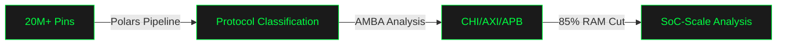
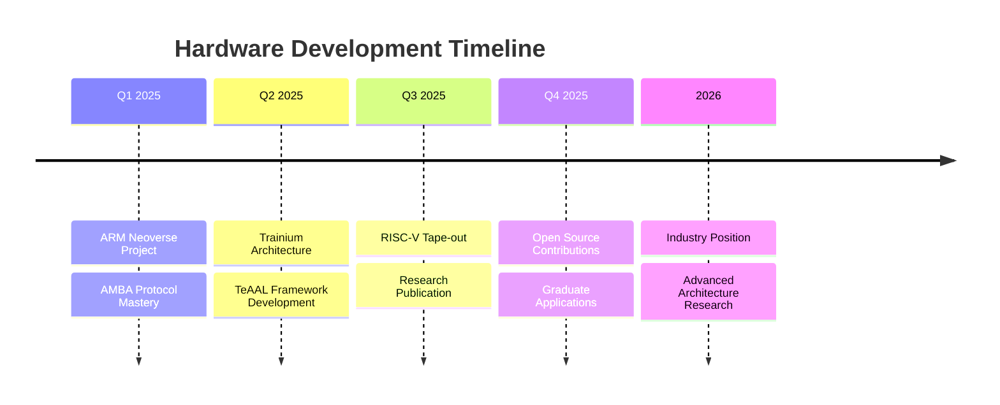

<!-- Animated Wave Header with Circuit Pattern -->
<div align="center">
  
</div>

<!-- Typing Animation with Hardware Focus -->
<div align="center">
  
[](https://git.io/typing-svg)

</div>

<!-- Professional Badges -->
<div align="center">
  
  [](https://github.com/pjwang24)
  [](https://linkedin.com/in/peterwang-eecs)
  [](mailto:pjwang2324@berkeley.edu)
  [](https://pjwang24.github.io/)
  
</div>

<br>

<!-- Circuit Animation -->
<div align="center">
  
</div>

## 🔬 About Me


```verilog
module PeterWang (
    input  wire clk,
    input  wire reset_n,
    output reg  [31:0] innovation
);

  parameter ROLE = "CS @ Berkeley | EE Minor";
  parameter GPA = 3.57;
  parameter FOCUS = "SoC Architecture & ASIC Design";
  
  reg [2:0] current_project;
  localparam ARM_NEOVERSE = 3'b001;
  localparam AWS_TRAINIUM = 3'b010;
  localparam RISCV_ASIC  = 3'b100;
  
  always @(posedge clk) begin
    if (!reset_n) 
      innovation <= 32'h0;
    else
      innovation <= innovation + 32'h1337;
  end
endmodule
```

### 🎯 Current Focus @ ARM & Berkeley SLICE Lab
- 🏗️ **ARM Neoverse CSS:** Pin analysis & AMBA protocol mapping for 20M+ pins
- 🧠 **AWS Trainium:** 2D systolic array design for Zebra accelerator
- 🔌 **RISC-V ASIC:** Full RTL-to-GDS flow with SKY130 PDK
- ⚡ **Performance:** 85% RAM reduction in SoC-scale analysis

<br clear="both">

---

## 🛠️ Technical Stack

<div align="center">

### 🔧 Hardware Design & Verification


### 🖥️ EDA Tools & PDKs


### ⚡ High-Performance Computing


### 🤖 ML/AI Frameworks


</div>

---

## 💼 Professional Experience

<div align="center">

### 🏢 **ARM** | Solutions Engineering, SoC Architecture Intern
*May 2025 — Aug 2025*



### 🔬 **Berkeley SLICE Lab** | AWS Trainium Architecture Researcher
*Jun 2025 — May 2026 | $500K+ Research Grant*

- Designing flexible 2D systolic arrays for Zebra accelerator
- Building PyTorch-to-Trainium framework via TeAAL
- Implementing profile-guided optimization for AWS infrastructure

### 📚 **UC Berkeley** | First EECS Peer Advisor
*Sep 2024 — May 2025 | Supporting 1,000+ Students*

</div>

---

## 🚀 Featured Hardware Projects

<div align="center">
  
| 🎯 Project | 📝 Description | 🛠️ Tech Stack | 📊 Impact | 🔗 Links |
|-----------|---------------|--------------|----------|---------|
| **3-Stage RISC-V ASIC** | Full RTL-to-GDS pipelined CPU with hazard resolution |   | Optimized timing, area, power | [](https://github.com/pjwang24) |
| **AWS Trainium Kernel** | NKI-optimized inference with manual memory scheduling |   | Low-latency execution | [](https://github.com/pjwang24) |
| **Branch Predictor** | Perceptron predictor with weighted history |  | 13% misprediction reduction | [](https://github.com/pjwang24) |
| **Finger-Vein Recognition** | IEEE Published NASNet biometric system |   | 36% training speedup | [](https://ieeexplore.ieee.org/abstract/document/9650980) |
| **EV Optimization** | Honda Research: ML-powered routing with L2 Ridge |   | 100K+ sessions analyzed | [](https://drive.google.com/file/d/1eJ1-RvuOJprvE-OXcbFbRktth9Zmozam/view) |

</div>

<div align="center">
  <a href="https://github.com/pjwang24?tab=repositories">
    
  </a>
</div>

---

## 📊 GitHub Analytics

<div align="center">
   
  
</div>

<div align="center">
  
</div>

---

## 🏆 Achievements & Recognition

<div align="center">

### 🎖️ Awards & Honors


### 📚 Publications
[](https://ieeexplore.ieee.org/abstract/document/9650980)

</div>

---

## 🎯 2025-2026 Roadmap

<div align="center">



</div>

### 🔬 Current Research Interests
- **🧠 Neuromorphic Computing** - Event-driven architectures
- **🔐 Hardware Security** - Side-channel attack mitigation
- **📐 Domain-Specific Architectures** - ML accelerators & systolic arrays
- **⚡ Near-Data Processing** - Compute-in-memory designs

---

## 🤝 Let's Connect!

<div align="center">
  
**Open to discussing SoC architecture, ASIC design, and hardware acceleration opportunities!**

<a href="mailto:pjwang2324@berkeley.edu">
  
</a>
<a href="https://linkedin.com/in/peterwang-eecs">
  
</a>
<a href="tel:909-551-5416">
  
</a>
<a href="https://github.com/pjwang24">
  
</a>

### 💡 Quick Facts
<details>
<summary><b>⚡ Click for Hardware Achievements</b></summary>
<br>

> 🔧 **ASIC Design:** Completed full RTL-to-GDS flow with SKY130 PDK
> 
> 📊 **Scale:** Analyzed 20M+ pins for ARM SoC architecture
> 
> 🚀 **Optimization:** Achieved 85% RAM reduction in protocol analysis
> 
> 🎯 **Performance:** Reduced branch misprediction by ~13%
> 
> ⚡ **CUDA:** 36% training time reduction with custom kernels

</details>

</div>

---

## 📈 Contribution Activity

<div align="center">
  
</div>

---

<div align="center">
  
### 🐍 Contribution Snake
  
<picture>
  <source media="(prefers-color-scheme: dark)" srcset="https://github.com/pjwang24/pjwang24/blob/output/github-contribution-grid-snake-dark.svg">
  <source media="(prefers-color-scheme: light)" srcset="https://github.com/pjwang24/pjwang24/blob/output/github-contribution-grid-snake.svg">
  
</picture>

</div>

---

<div align="center">
  
</div>

<div align="center">
  
**"The best hardware is the one that makes software developers happy."** - Linus Torvalds

Building the silicon that powers tomorrow 🔧

</div>
